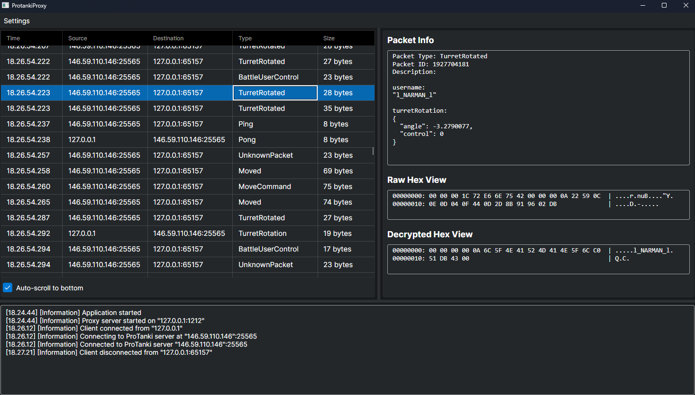

# ProtankiProxy



A proxy tool for intercepting and analyzing Protanki game traffic. This tool allows you to monitor and analyze the network communication between the Protanki client and server.

This project uses [ProtankiNetworking](https://github.com/juhe1/ProtankiNetworking) library for handling the game's network communication.

## Features

- Real-time packet interception and monitoring
- JSON-formatted packet data display
- Raw and decrypted hex views of packet data
- Connection settings configuration

## Requirements

- .NET 8.0 or later
- Windows operating system
- Protanki game client

## Usage

1. Launch the ProtankiProxy application
2. Configure connection settings:
   - Click "Settings" -> "Connection Settings"
   - Set the local proxy port (default: 1212)
   - Set the Protanki server address and port
3. Start the proxy server
4. Configure your Protanki client to use the proxy.
5. The proxy will now display all game traffic

## Packet View

The main window shows:
- A list of intercepted packets with timestamp, source, destination, type, and size
- Detailed packet information when a packet is selected
- Raw hex view of the packet data
- Decrypted hex view of the packet data
- Auto-scroll toggle for the packet list

## Connection Settings

You can configure:
- Local proxy port
- Protanki server address
- Protanki server port

Settings are saved between sessions.

## Building from Source

1. Clone the repository
2. Build ProtankiProxy:
   ```bash
   dotnet build -c Release
   ```

The application will be built as a self-contained executable that doesn't require .NET runtime to be installed.

## Download

Pre-built binaries for Windows, Linux, and macOS are available on the [Releases page](https://github.com/juhe1/ProtankiProxy/releases).

1. Go to the [ProtankiProxy Releases](https://github.com/juhe1/ProtankiProxy/releases)
2. Download the appropriate binary for your operating system (Windows, Linux, or macOS)
3. Extract the archive and run the executable

No manual build is required if you use the pre-built binaries.